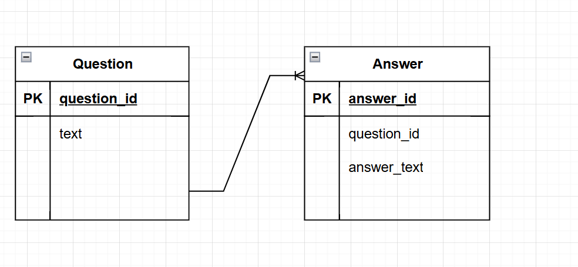

# **SBNA Game Show**

# Question & Answer Schema  

Entity Relation Diagram

**By: Austin Sinclair, Ayushi Patel – Team Pathfinder**

**Database:** MongoDB

**Collections:** Questions, Answers

**Rationale:** This will be considered a prototype for how our data will be stored. As we are still in the early planning stages, it is possible we will need to add more. Essentially, the Questions Collection will keep unique ID values for each question, and the question’s respective text (“Name a Sanskrit word used in yoga practice.”).  
 The questions have no right or wrong answers, but each question will receive many different answers from the users. Thus, Questions and Answers have a many to one relationship.  
The Answers Collection will record unique ID values for each response and will have an embedded document linking the question ID value to an answer value.

_Answer Example:_

{  
\_id: "a1"  
response: {question_id: “q1”, answer: “Garudasana”}  
};

Hopefully this document gives other teams something to go off of when designing. We are more than welcome to suggestions. For now, I believe this database storage will suit the questionnaire purposes, allowing answers to be retrieved based on question IDs.
